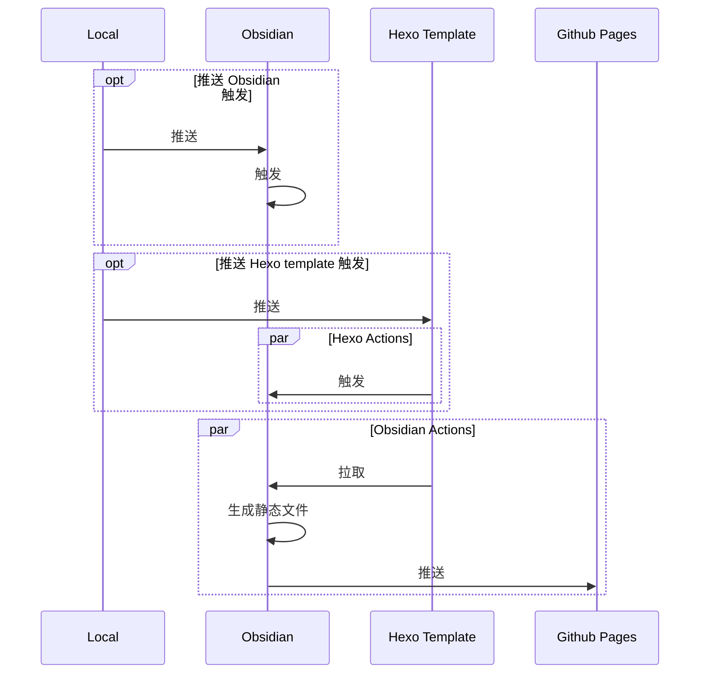

当前网页使用 Obsidian 作为编辑器以及知识库，Hexo 作为静态博客框架，也、就是将markdown文档转换为静态 html ，放在 Github 并且部署 Github Pages 上的。

个人需需要将 Obsidian 的 markdown 文档放置在一个私有仓库，将 Hexo Template 放置在共有仓库，github pages 也放在另一个仓库，当然 Hexo Template 可以和 Github Pages 放在相同的仓库中，如果Hexo Template也需要分离的话在将其分离。

静态博客框架仓库和部署仓库分离的好处是如果更换静态博客框架例如Gatsby，VuePress的话，可以不需要修改部署仓库只需要新建新的静态博客框架仓库，调整Obsidian 仓库的 Actions 就可以。

分离的坏处就是需要有一个额外的仓库管理静态博客框架，当然个人觉得好处大于坏处。

在 Obsidian 仓库，和 Hexo 仓库分别设置了两个 Actions，Obsidian 的仓库 Actions 是主 Actions，Hexo 的 Actions 只是为了触发主 Actions。

也可以将主 Actions 放在 Hexo 上，甚至应该放到静态博客框架仓库里面，如果要更换静态博客框架，肯定需要重新修改主 Actions ，而且是大幅修改，而 Obsidian Actions 只需要修改触发的主 Actions 就可以，减少了不必要的 Obsidian 仓库的变动，如果没有仓库洁癖这些问题都是小问题。

本网站的部署 Actions 整体思路大致如下（ Local 代表本地仓库）：

